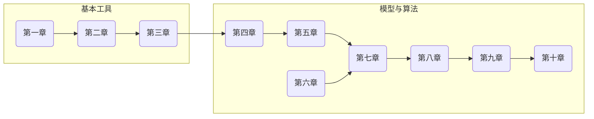

# 《强化学习的数学原理》的翻译笔记

- 原作书籍《Mathematical Foundations of Reinforcement Learning》的 [github目录](https://github.com/MathFoundationRL/Book-Mathmatical-Foundation-of-Reinforcement-Learning)
- 本人初学者，如有错误，请指正谢谢。

## 更新目录：

- [x]   <第一章：强化学习的基本概念>
- [x]   <第二章：贝尔曼公式>
- [x]   <第三章：贝尔曼最优公式>
- [x]   <第四章：值迭代和策略迭代>
- [x]   <第五章：蒙特卡洛方法>
- [ ]   第六章：随机近似
- [ ]   第七章：时序差分法
- [ ]   第八章：值函数近似
- [ ]   第九章：策略梯度法
- [ ]   第十章：演员 - 评论家算法

